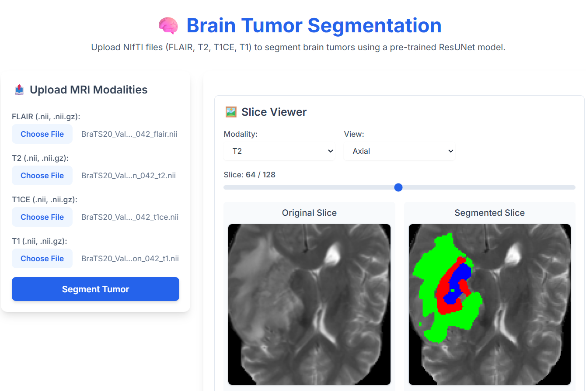
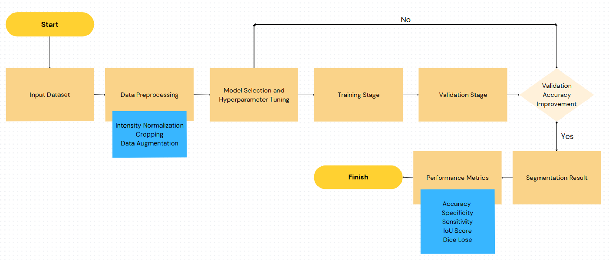

# Brain-Tumor-Segmentation

# 🧠 3D Brain Tumor Segmentation using Improved 3D Residual U-Net with Attention Gates (BraTS 2020)

This project implements a **3D brain tumor segmentation pipeline** using an **Improved 3D Residual U-Net with Attention Gates**, trained on the **BraTS 2020** dataset.

The model processes multimodal MRI scans — **T1, T1CE, T2, FLAIR** — and segments three clinically important tumor sub-regions:

- **NC** — Necrotic / Non-Enhancing Core  
- **ED** — Peritumoral Edema  
- **ET** — Enhancing Tumor  

The pipeline also includes a **Flask-based web interface** for visualization, slice navigation, tumor volume computation, and model inference.



---

## 📌 Features

- ✔️ Improved 3D Residual U-Net + Attention Gates  
- ✔️ Multimodal input (4 MRI modalities)  
- ✔️ 3D volumetric segmentation  
- ✔️ Dice + Focal Loss combination  
- ✔️ Full preprocessing workflow  
- ✔️ Flask-based interactive web app  
- ✔️ Tumor volume & percentage computation  
- ✔️ Axial / Coronal / Sagittal slice viewer  
- ✔️ Slice-based video generation  

---

## 📂 Project Structure

```
├── data/
├── src/
│   ├── preprocessing/
│   ├── model/
│   ├── training/
│   ├── inference/
│   └── utils/
├── webapp/
│   ├── static/
│   ├── templates/
│   └── app.py
├── saved_models/
└── README.md
```

---

## 🚀 1. Experimental Setup

| Component     | Specification |
|---------------|--------------|
| Platform      | Kaggle Notebook, VS Code |
| Language      | Python 3.11 |
| Frameworks    | TensorFlow, Keras, Nibabel, NumPy, OpenCV, Matplotlib, Scikit-learn |
| Model         | Improved 3D Residual U-Net with Attention Gates |
| Loss          | Dice Loss + Categorical Focal Loss (γ=2.0, α=0.25) |
| Optimizer     | Adam |
| Learning Rate | 0.0001 (Reduce-on-Plateau) |
| Batch Size    | 1 |
| Epochs        | 40 |
| Input Shape   | (128, 128, 128, 4) |
| GPU           | NVIDIA Tesla T4 |
| RAM           | 30 GB |


  
  
  


---

## 🧹 2. Dataset & Preprocessing

**Dataset:**  
**BraTS 2020** — 369 patient volumes, 4 MRI modalities.

### Preprocessing Steps

- Crop **240×240×155 → 128×128×128**
- Normalize each modality
- Stack channels → **(128,128,128,4)**
- One-hot encode masks (4 classes)
- Augmentation:
  - Random flip
  - Rotation  
  - Intensity shift  

### Train/Val/Test

- **71%** Training  
- **17%** Validation  
- **12%** Test  


---

## 🏋️ 3. Training & Validation

- Training on Kaggle GPU (P100/T4)  
- LR scheduler + Early stopping  
- Composite loss handles class imbalance  

**Metrics tracked:**  
• Dice  
• IoU  
• Sensitivity  
• Specificity

---

## 📊 4. Performance Metrics

### Dice, IoU, Sensitivity, Specificity (All Regions)

| Split | Region | Dice | IoU | Sensitivity | Specificity |
|-------|--------|-------|-------|-------------|-------------|
| **Training** | TC | 0.8647 | 0.7793 | 0.8560 | 0.9983 |
|  | WT | 0.9097 | 0.8395 | 0.9080 | 0.9971 |
|  | ET | 0.7348 | 0.6395 | 0.8293 | 0.9989 |
| **Validation** | TC | 0.8364 | 0.7408 | 0.8277 | 0.9981 |
|  | WT | 0.8986 | 0.8224 | 0.8995 | 0.9971 |
|  | ET | 0.7244 | 0.6267 | 0.8317 | 0.9981 |
| **Test** | TC | 0.8573 | 0.7734 | 0.8520 | 0.9969 |
|  | WT | 0.9169 | 0.8498 | 0.9144 | 0.9972 |
|  | ET | 0.7070 | 0.6150 | 0.8600 | 0.9980 |

✔ **Best Performance:** WT Dice = **0.9169**

---

## 🆚 5. Comparative Analysis

### Against Baseline Models

| Model | TC | WT | ET |
|-------|------|------|------|
| 3D ResUNet | 0.5830 | 0.7583 | 0.6602 |
| 3D ResUNet (Pretrained) | 0.7601 | 0.8910 | 0.7241 |
| **Proposed Model** | **0.8573** | **0.9169** | 0.7070 |

### Key Improvements

- **+27.2% Dice (TC)** vs basic ResUNet  
- **+21% Dice (WT)**  
- Highest sensitivity for ET  

---

## 🏆 6. Comparison with State-of-the-Art

| Year | Method | Dice Score (WT) |
|------|--------|------------------|
| 2022 | Attention Res-UNet with Guided Decoder (ARU-GD) | **91.10** |
| 2023 | Improved DNN with Fast Fuzzy C-Means (FFCM) | **89.74** |
| 2023 | Improved Residual Network (ResNet) | **86.40** |
| 2023 | U-Net with Channel & Spatial Attention (CBAM) | **90.80** |
| 2023 | dResU-Net (3D Residual U-Net) | **86.60** |
| 2023 | CBAM-U-Net++ | **88.64** |
| 2023 | Res-Gated-3DUNet with BNet55 Blocks | **86.90** |
| 2024 | 2D U-Net (T1ce + FLAIR Modality Combination) | **84.81** |
| **2025** (**Proposed**) | **Improved 3D ResUNet with Attention Gates**| **91.69** |

✔ **Achieves highest WT Dice among compared methods.**

---

## 🎨 7. Prediction Visualization

Supported visualization features:

- Multi-orientation slice viewer (Axial / Coronal / Sagittal)
- Mask overlay  
- 3D segmentation interpretation  
- Slice-by-slice progression video  

### Color Coding

- **Green:** NC  
- **Blue:** ED  
- **Red:** ET  

---

## 🌐 8. Web Interface (Flask)

### Features

- Upload all 4 MRI modalities  
- Automatic preprocessing + inference  
- Slice visualizer  
- Tumor volume & percentage computation  
- Video generation across slices  

### Tech Stack

- Flask (Backend)  
- HTML / CSS / JS (Frontend)  
- NumPy + Nibabel (3D handling)  
- TensorFlow (Inference)  

---

## 📦 9. Model Export

Final trained model saved as:

```
saved_models/final_model.h5
```

Includes:

- Architecture  
- Weights  
- Loss & optimizer configs  

Loadable directly for inference.

---

## 🔮 10. Future Work

### 1️⃣ Post-processing Refinements
- CRFs  
- Connected Components  
- Morphological Filtering  

### 2️⃣ Survival Prediction & Grading
Using radiomics + ML to predict:

- Tumor grade (LGG vs HGG)  
- Overall survival (OS)  

---

## 🛠️ Installation & Usage

### Install dependencies

```bash
pip install -r requirements.txt
```

### Run inference

```bash
python src/inference/predict.py --input path/to/modalities/
```

### Launch the web app

```bash
cd webapp
python app.py
```

---

## 📬 Contact

For questions or contributions, please open an **Issue** or **Pull Request**.

